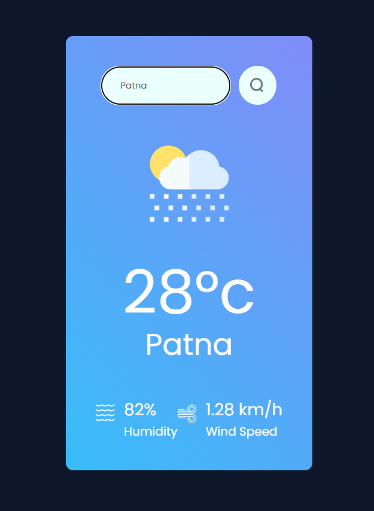
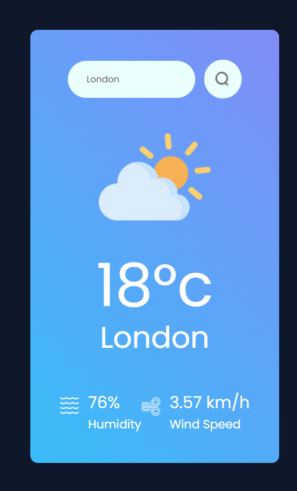

# 🌦️ Weather App

A **beautiful and responsive weather application** built with **React + Vite** that fetches real-time weather data using the **OpenWeatherMap API**.  

Search any city to instantly view **temperature**, **humidity**, **wind speed**, and **weather conditions** — all displayed with a **modern UI** and clean icons.

---

## ✨ Features

- 🔍 **City Search** – Get weather details for any location worldwide  
- 🌡 **Live Weather Data** – Real-time temperature, humidity, and wind speed  
- 🎨 **Modern UI** – Gradient cards with weather icons for better visualization  
- 📱 **Responsive Design** – Works seamlessly on desktop and mobile  
- ⚠️ **Error Handling** – Alerts if a city is not found  

---

## 🛠️ Tech Stack

- **Frontend:** React (Vite) ⚡  
- **Styling:** CSS3 (Custom responsive design) 🎨  
- **API:** [OpenWeatherMap](https://openweathermap.org/api) ☁️  

---

## 📸 Screenshots  

### Patna  
# 🌦️ Weather App

A **beautiful and responsive weather application** built with **React + Vite** that fetches real-time weather data using the **OpenWeatherMap API**.  

Search any city to instantly view **temperature**, **humidity**, **wind speed**, and **weather conditions** — all displayed with a **modern UI** and clean icons.

---

## ✨ Features

- 🔍 **City Search** – Get weather details for any location worldwide  
- 🌡 **Live Weather Data** – Real-time temperature, humidity, and wind speed  
- 🎨 **Modern UI** – Gradient cards with weather icons for better visualization  
- 📱 **Responsive Design** – Works seamlessly on desktop and mobile  
- ⚠️ **Error Handling** – Alerts if a city is not found  

---

## 🛠️ Tech Stack

- **Frontend:** React (Vite) ⚡  
- **Styling:** CSS3 (Custom responsive design) 🎨  
- **API:** [OpenWeatherMap](https://openweathermap.org/api) ☁️  

---

## 📸 Screenshots  

### Patna  
  

### London  
  

-----------------------------------------------------------------------------------------------------------------------------------------------------------------------------------------
